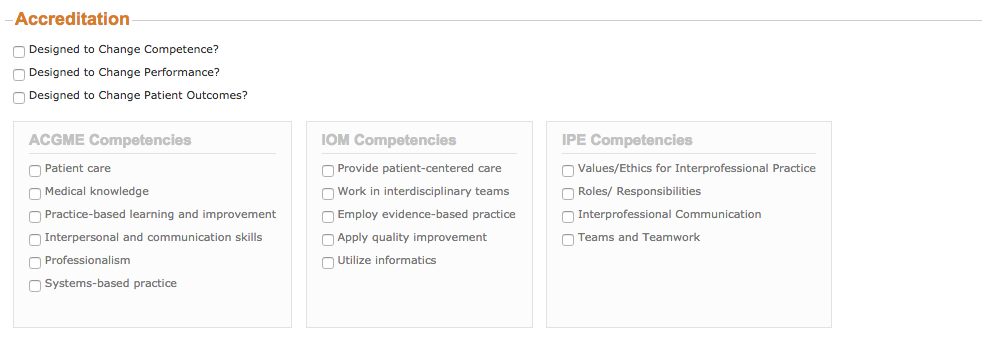

#Activities: Accreditation

---

---

##Designed to Change Competence?:
>level 1 in ascending precedence.

- ###Will changes in Competence Be Measured?`
    - This box is automatically checked when the "Designed to Change Competence?" check box is checked.

##Designed to Change Performance?:
>level 2 in ascending precedence.

##Designed to Change Patient Outcomes?:
>level 3 in ascending precedence.

##ACGME Competencies

- Patient Care
- Medical knowledge
- Practice-based learning and improvement
- Interpersonal and communication skills
- Professionalism
- Systems-based practice

---

##IOM Competencies

- Provide patient-centered care
- Work in interdisciplinary teams
- Employ evidence-based practice
- Apply quality improvement
- Utilitze informatics

---

##IPE Competencies

- Values/Ethics for Interprofessional Practice
- Roles/Responsibilities
- Interprofessional Communication
- Teams and Teamwork
