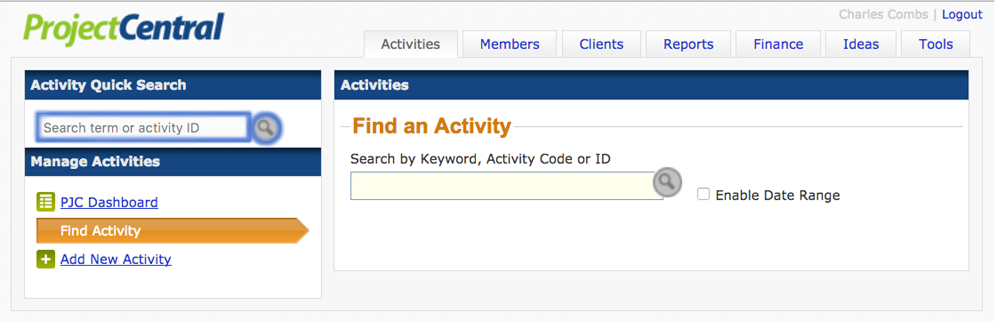
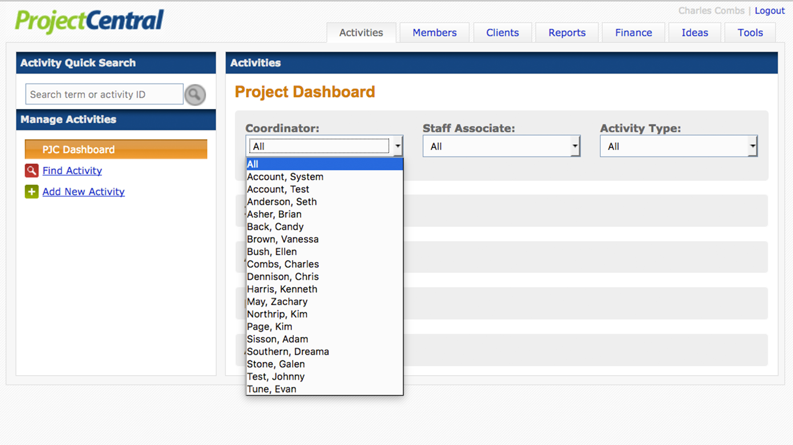
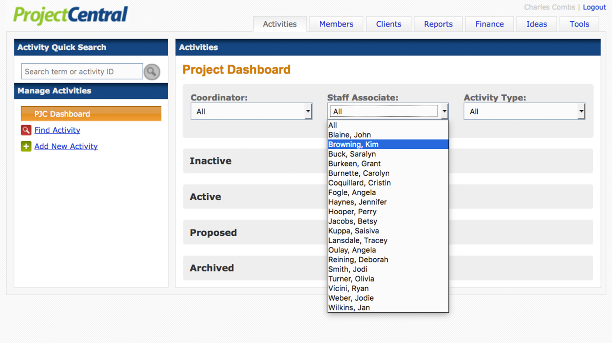
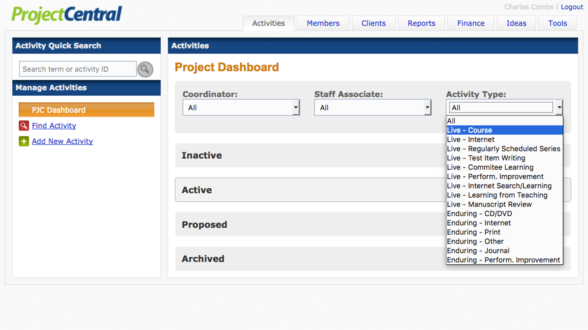
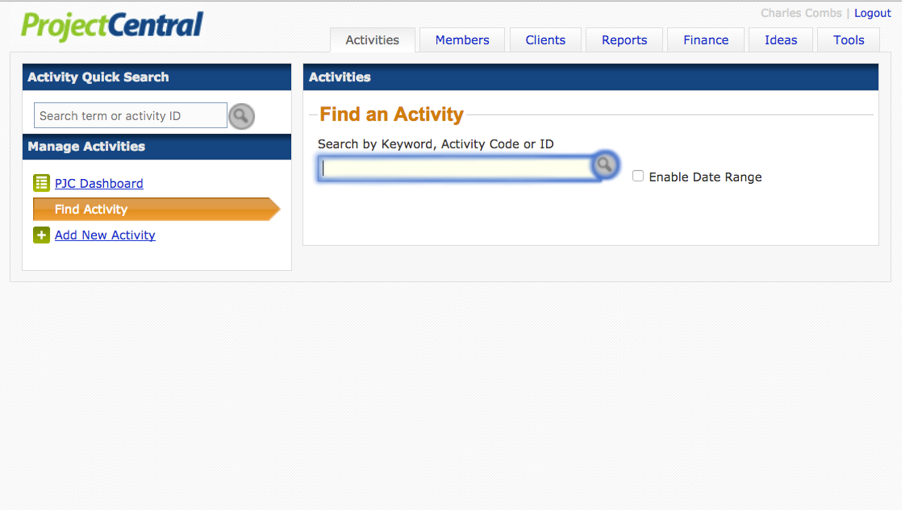
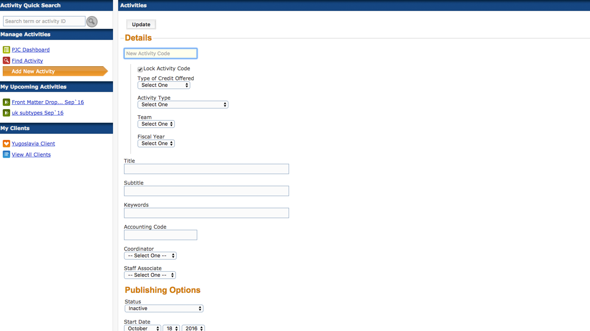
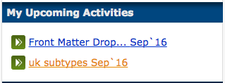
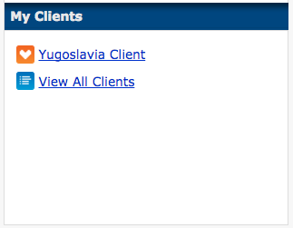

# `Activities`

---

##[Quick Search](/activity-dialog)

---

---

>Search here using a Keyword, Activity Code, or Activity ID.

---

##[Dashboard](/activity-dialog)

---

> The Project Dashboard provides search and filters for each of 7 category tabs.
> These are Activities, Members, Clients, Reports, Finance, Ideas and Tools.

---

##Coordinator

---

---

>Make a selection here to display activities by a specific Coordinator. The
>default selection is *All*.

---

##Staff Associate

---

---

>Make a selection here to display activities by a specific Staff Associate. The
>default selection is *All*.

---

##Activity Type

---

---

>Make a selection here to display activities of a specific type. The
>default selection is *All*.

---

##[Find Activity](/activity-dialog)

---

---

>Find an Activity: search here using a Keyword, Activity Code, or Activity ID. 
>Click the checkbox to enable searching by date range.

---

##[Add New](/activity-dialog)

---

---

>Add New Activity in the Manage Activities sidebar on the Activities dashboard
> allows you to fill in the initial details for a new activity. This screen will
> appear again as the Activity Details dialog when editing an existing activity.

---

##Upcoming

---

---

>Provides a list of approaching activities the user is associated with as
> Coordinator or Staff Associate. $$$

---

##My Clients

---

---

>Provides a list of Clients the user is associated with as a Client Contact.
> For more information regarding Clients and Client Contacts refer to
> Clients in the navigation menu.  $$$

---

>$$$ needs citation
