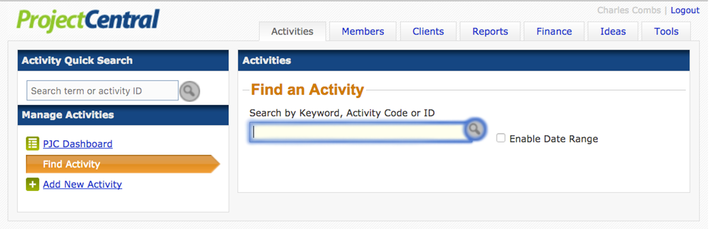

#Activities

---

##[`Activity Quick Search`](/activity-details)

---

---
>**_Find an Activity_**: Search here using a Keyword, Activity Code, or Activity ID. 
>Click the checkbox to enable searching by date range.

---

##[`PJC Dashboard`](/activity-details)

---

###Coordinator

---

---

>Make a selection here to display activities by a specific Coordinator. The
>default selection is *All*.

---

###Staff Associate

---

---

>Make a selection here to display activities by a specific Staff Associate. The
>default selection is *All*.

---

###Activity Type

---

---

>Make a selection here to display activities of a specific type. The
>default selection is *All*.

---

##[Details](/activity-details)

---

>A short description of "Details".

---

##Credit

---

>A short description of "Credit".

---

##[Front Matter](/front-matter)

---

>A short description of "Front Matter".

---

##Assets

---

>A short description of "Assets".

---

##Faculty

---

>A short description of "Faculty".

---

##Registrants

---

>A short description of "Registrants".

---

##Credit Recipients

---

>A short description of "Recipients".

---

##Sponsors

---

>A short description of "Sponsors".

---

##Registration Form

---

>A short description of "Registration Form".

---

##Media

---

>A short description of "Media".

---

##Assessments

---

>A short description of "Assessments".

---
  
##More

---

>A short description of "More".
