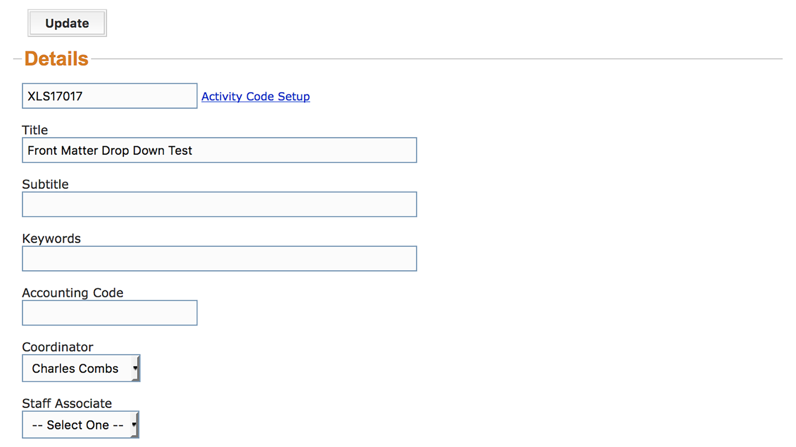

#`Activity Dialog`

---

##[Details](/activity-details)

---

---

>The Activity Details menu dialog is the initial dialog screen for creating a new
> activity. The important top-level details for an activity are assigned in this 
> dialog.  You will title the activity here, assign keywords for search, make
> personnel selections, and determine visibility here.  Additionally this is
> where start date and end date are defined. Details regarding Accrediation,
> Location, Outcomes and Topics are chosen from selections here. Click through
> for additional information.

---

##[Credit](/credit)

---
 

---

>The Credit menu dialog will show in the sidebar for enduring activities and
> live events without sessions. Credits are selected from a list of options and
> attached to the activity here.

---

##[Sessions](/activity-sessions)

---
 

---

>The Sessions menu dialog (referred to as the Session Editor) replaces the Credit
> menu dialog in the sidebar for live events with sessions. The "has sessions"
> option must be selected in the Details dialog or this menu item will not
> display. Credit is attached per session.

---

##[Agenda](/agenda)

---

---

>The Agenda menu dialog only appears in the sidebar after a live event has had
> its first session defined. The agenda is meant to serve as an easily readable
> reference. Any changes to the Agenda must be made in the Session Editor.

---

##[Front Matter](/front-matter)

---

---

>The Front Matter menu dialog (referred to as the Front Matter Editor) is where
> materials related to the timing, location, sponsorship and focus of an activity
> or event are attached to the Activity for publishing on cecentral.com. Front
> Matter items are selected from a list containing up to 22 options.

---

##[Assets](/assets)

---

---

>The Assets menu dialog allows the upload of files related to the accreditation,
> administration, faculty, and finances of an activity. General notes and
> teaching materials are also attached to activities here.

---

##[Faculty](/faculty)

---

---

>The Faculty menu dialog is where the faculty's cecentral.com membership accounts
> are associated with an activity. The dialog contains a Quick Entry form, for
> use in cases where faculty do not already have an account.  The Quick Entry
> form generates new membership accounts.

---

##[Registrants](/registrants)

---

---

>The Registrants menu dialog is where current registrants are displayed in a
> list. The membership accounts are searchable from here, with the option to add
> a member as a registrant. This dialog contains Quick Entry and Full Entry
> forms for student accounts. It is advised these be used sparingly or not at
> all. Use of these forms frequently leads to data fragmentation due to the
> creation of multiple accounts for one user. Merging duplicate accounts can
> be done through Project Central (carefully). No database operations will be
> performed to correct account entry and merge errors.

---

##[Recipients](/credit-recipients)

---

---

>A short description of Credit Recipients.

---

##[Sponsors](/sponsors)

---

---

>A short description of Sponsors.

---

##[Registration](/registration-form)

---

---

>A short description of Registration Form.

---

##[Media](/media)

---

---

>A short description of Media.

---

##[Assessments](/assessments)

---

---

>A short description of Assessments.

---

##[More...](/more)

---

---

>Infrequently used menu dialogs are assigned to this menu overflow dialog.
> Activity Finances, Budget, Configurarion, Coupon Codes, eLearning Community,
> Notes, Notifications, and Outcomes all open from here.

---