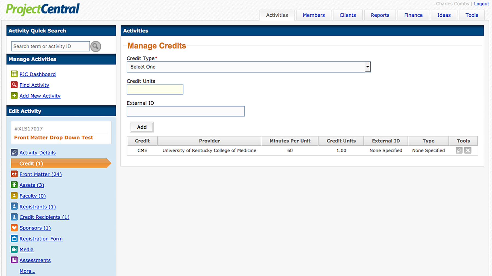
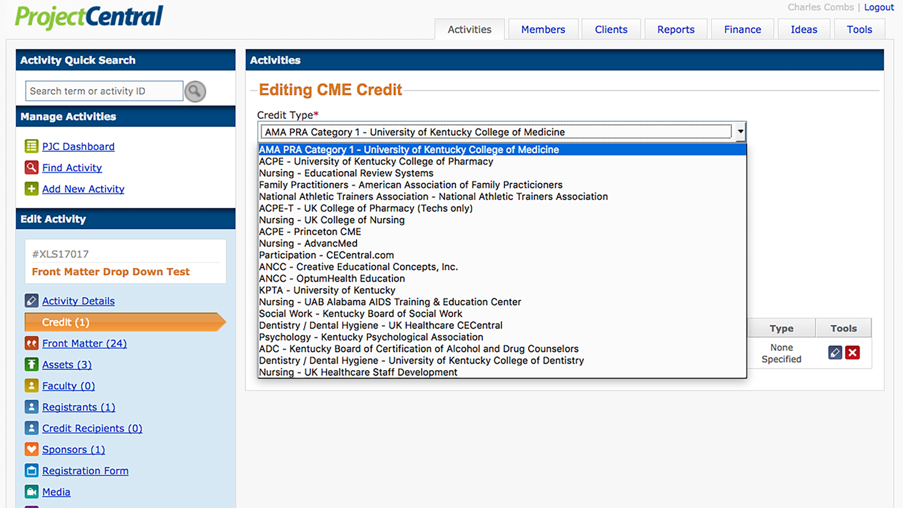
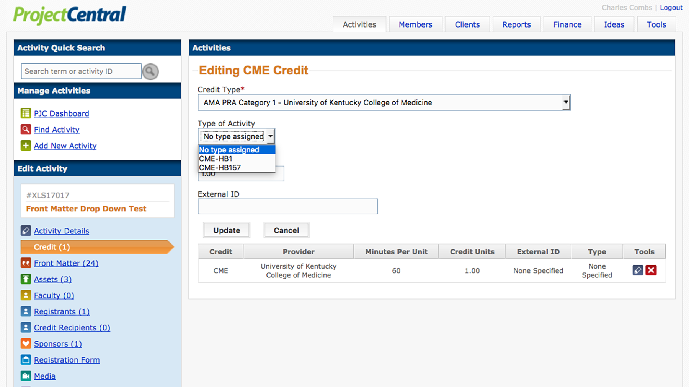
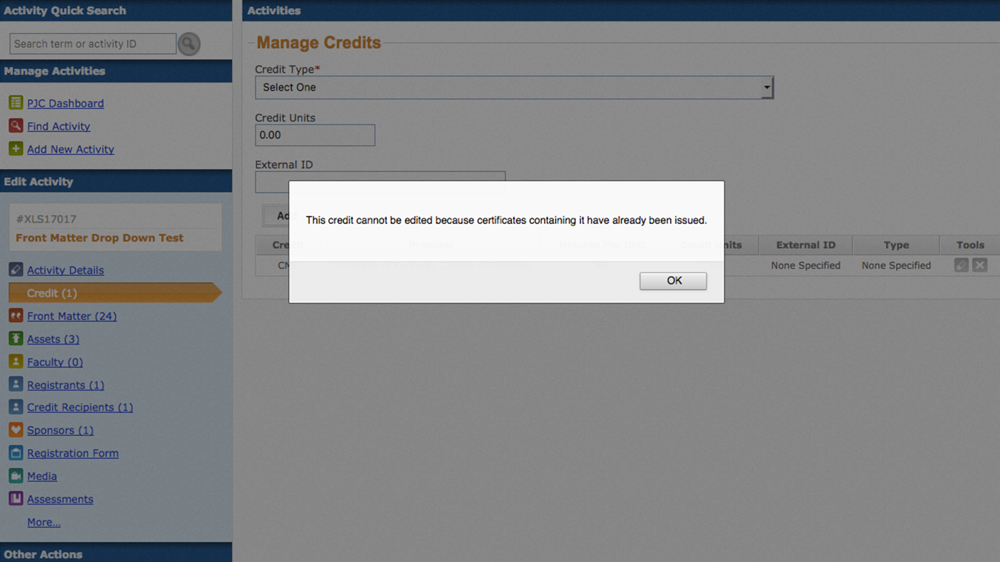

#Activites: `Credit`

---

##Manage

---

---

>The Manage Credits form with-in the Credit dialog consists of 2 drop down
> select boxes containing options for type and subtype and 2 text entry fields
> for credit amount and external id. When credit is attached to an activity a
> table of attached credits will appear below the form.

---

##Credit

---

---

>Select the credit type you wish to attach to the activity from this drop down
> select box. Credit type names either begin with an accrediting body or a
> profession. The second portion of the credit type name is the credit provider.

---

##Type

---

---

>If the credit type you have selected has required or optional sub-types, you
> will choose between them in this drop down select box. For example,
> AMA PRA Category 1 credit might be of subtype CME-HB1.

---

##Units

---

>Enter an integer or floating point number representing the amount of credit you
> wish to attach to the activity. This will not be a direct relation to credit
> hours in all cases. Some credit types are calculated with 50 minute hours.

---

##External ID

---

>This is an optional text field allowing for the entry of program numbers and
> expiration dates on an activity by activity basis.

---

##Add

---

>The Add button must be clicked to upload information to the site. Navigating
> away from the page without submitting the form will result in lost data.

---

##Table

---

>A table giving a brief description of credits attached to the activity will
> appear below the Manage Credits form. This portion of the view is blank
> when there are no credits attached to an activity.

---

##Edit

---

---

>A pencil icon appears in the far right of each row of the credit list.
> Click on it to open the credit type for editing. If the credit type
> you wish to edit has already been assigned to credit recipients, you
> will not be able to use this feature. To proceed with editing the
> credit, all credit recipients holding that credit must have their
> credit revoked in the Credit Recipients dialog.

---

##Remove

---

>Credit may be removed from an activity by clicking the red x icon next to the
> pencil icon in the far right of each row of the credit list table. As with
> editing existing credit, a credit may not be modified (including removal)
> after it has been awarded to student. As with editing existing credit, moving
> forward with deletion of an awarded credit requires revoking the awarded
> credit.

---