#Activities: Front Matter

---

##Manage Content

---

>The **Add Content** button and the **Front Matter List** display under the **Manage
>Content** heading in the **Front Matter Dialog**

---

##`Enduring Activities` <!--*(.+)\/activity\/\d{4}*-->

---

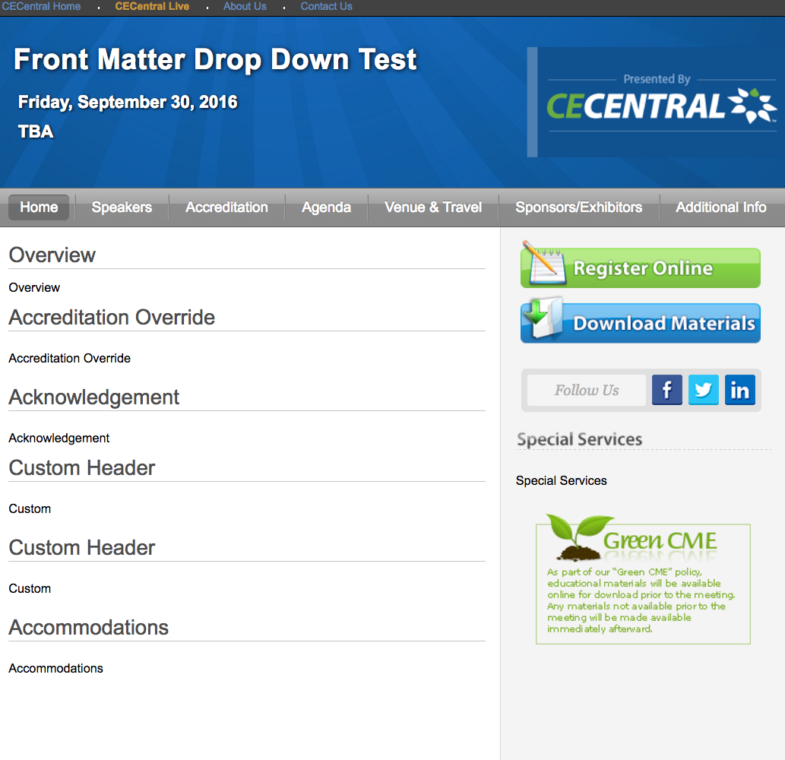

---

###`Add Content`

>Clicking the **Add Content** button opens the **Front Matter Editor**.

---

###Content Type\*
`Select One`

---

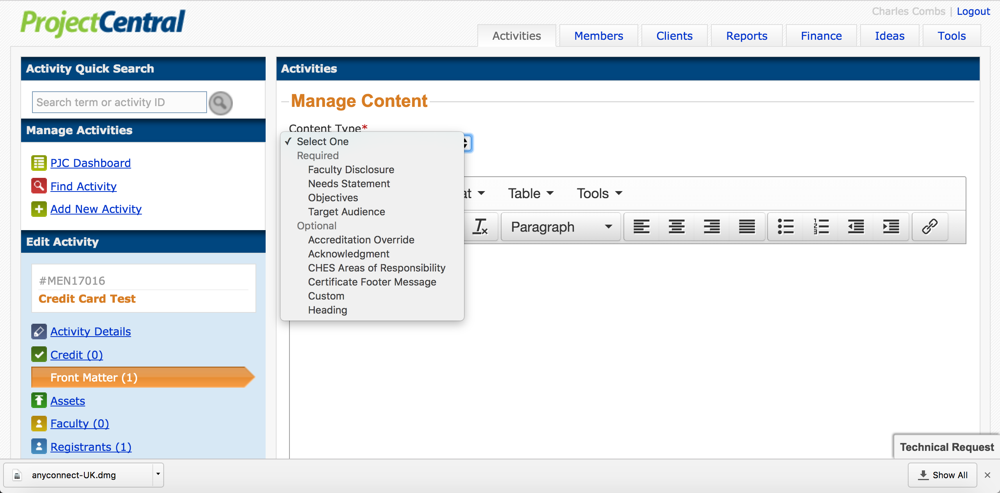

---

*Select One*

`Required`

Faculty Disclosure
>This *required* custom content, generated by the Coordinator, appears in the
>**Activity Home** tab of the Enduring Activity page.

Needs Statement
>This *required* custom content, generated by the Coordinator, states the learning
>need for the activity, and appears in the **Activity Home** tab of the Enduring
>Activity page.

Objectives
>This *required* custom content, generated by the Coordinator, states the learning
>objectives for the activity, and appears in the **Activity Home** tab of the
>Enduring Activity page.

Target Audience
>This *required* custom content, generated by the Coordinator, lists the
>profession(*s*) and specialt*y*(*ies*) served by the activity, and appears in the
**Activity Home** tab of the Enduring Activity page.

`Optional`

Accreditation Override
>This *optional* custom content, overriding the system generated content, provides
>the required language for accreditation of the activity in circumstances not
>covered by the default language. Accreditation statements appear in the
>**Activity Home** tab of the Enduring Activity page. 
 
Acknowledgment
>This *optional* custom content, overriding the system generated content, provides
>acknowledgement of Sponsors (Clients) for the activity in circumstances not
>covered by the default language.  Acknowledgement statements appear in the
>**Activity Home** tab of the Enduring Activity page. 

CHES Areas of Responsibility
>**Is this optional system generated content?**
>Statements pertaining to the [Seven Areas of Responsibility](http://www.nchec.org/responsibilities-and-competencies) for a Certified Health Education
>Specialist as they relate to the activity. CHES statements appear in the
>**Activity Home** tab of the Enduring Activity page.

Certificate Footer Message
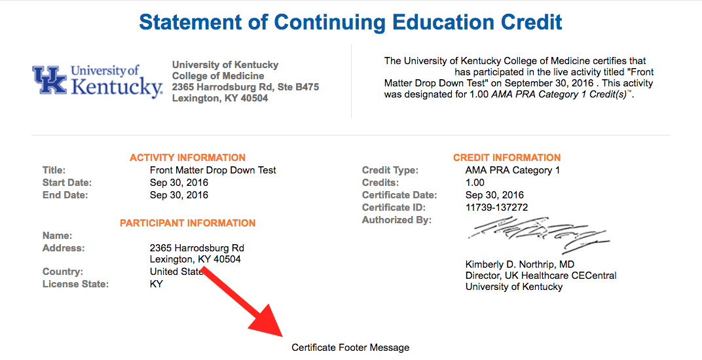
>This *optional* custom content, overriding the system generated content, provides
>custom text for the footer of the certificate.

Custom
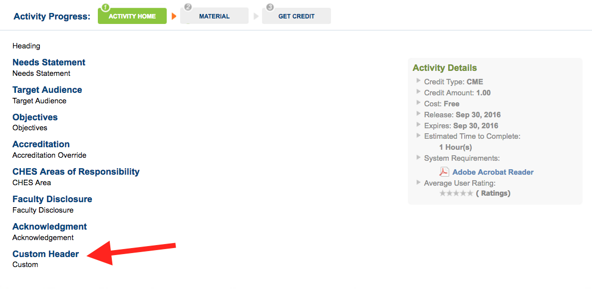
>This *optional* custom content, generated by the Coordinator, creates a custom
>section of text underneath a custom heading on the **Activity Home** tab of the
>Live Event page.

Heading
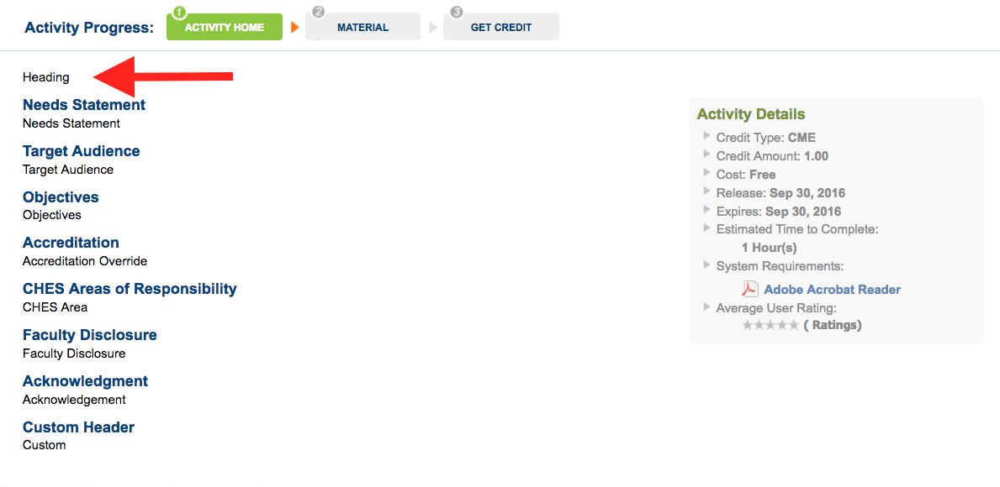
>This *optional* custom content, generated by the Coordinator, ... appears in
>the **Activity Home** tab of the Live Event page.

---

##`Live Events` <!--*(.+)\/live\/\d{4}*-->

---

###`Add Content`

>Clicking the **Add Content** button opens the **Front Matter Editor**.

---

###Content Type\*
`Select One`

---

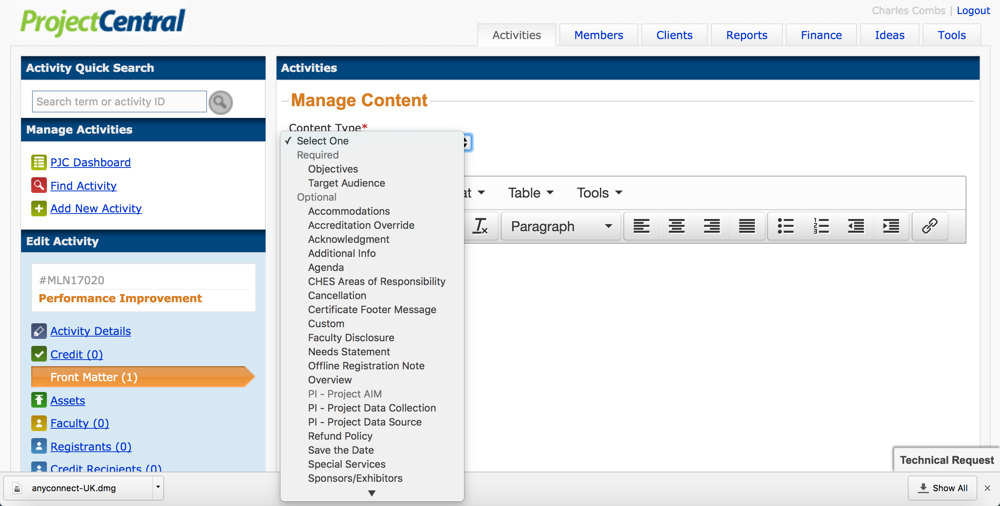

---

*Select One*

`Required`

Objectives
>This *required* custom content, generated by the Coordinator, states the learning
>objectives for the activity, and appears in the **Accreditation** tab of the Live
>Event page.

Target Audience
>This *required* custom content, generated by the Coordinator, lists the
>profession(*s*) and specialt*y*(*ies*) served by the activity, and appears in the
>**Accreditation** tab of the Live Event page.
    
`Optional`

Accommodations
>This *optional* custom content, generated by the Coordinator, details
>accommodations near the Live Event Venue and appears in the **Home** tab of the
>Live Event page.

Accreditation Override
>This *optional* custom content, overriding the system generated content, provides
>the required language for accreditation of the activity in circumstances not
>covered by the default language. Accreditation statements appear in the **Home** *AND*
>**Accreditation** tabs of the Live Event page. 

Acknowledgment
>This *optional* custom content, overriding the system generated content, provides
>acknowledgement of Sponsors (Clients) for the activity in circumstances not
>covered by the default language.  Acknowledgement statements appear in the
>**Home** and **Accreditation** tabs of the Live Event page. 

Additional Info
>This *optional* custom content, generated by the Coordinator, details
>information such as parking arrangements and appears in the **Additional Info** tab
>of the Live Event page.

Agenda
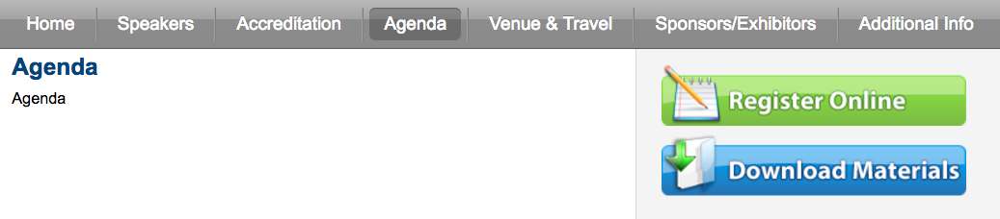
>This *optional* custom content, overriding the system generated content,
>defines the agenda for an activity in circumstances not covered by the default
>agenda and appears in the **Agenda** tab of the Live Event page.

CHES Areas of Responsibility
>**Is this optional system generated content?**
>Statements pertaining to the [Seven Areas of Responsibility](http://www.nchec.org/responsibilities-and-competencies) for a Certified Health Education
>Specialist as they relate to the activity. CHES statements appear in the
>**Accreditation** tab of the Live Event page.

Cancellation*
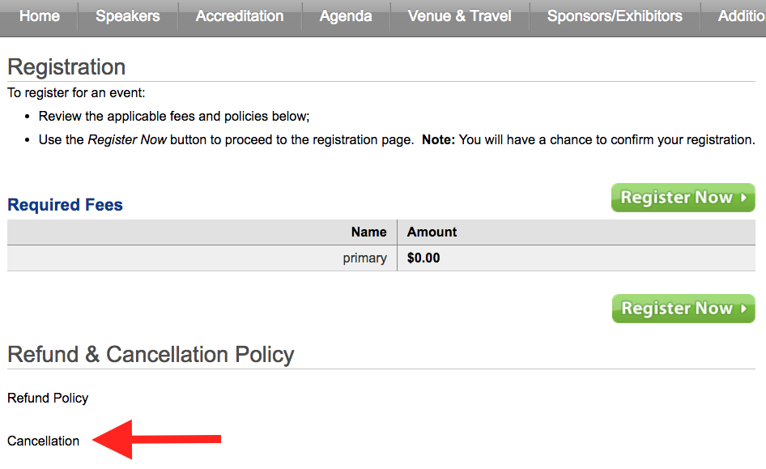
>This *optional* custom content, overriding the system generated content, provides
>a cancellation policy and instructions in circumstances not covered by the
>default cancellation policy. The cancellation policy appears at the bottom of
>the **Registration Form**.

Certificate Footer Message

>This *optional* custom content, overriding the system generated content, provides
>custom text for the footer of the certificate.

Custom
>This *optional* custom content, generated by the Coordinator, creates a custom
>section of text underneath a custom heading on the **Home** tab of the Live Event
>page.

Faculty Disclosure
>This *optional* custom content, generated by the Coordinator, appears in the
>**Speakers** tab of the Live Event page.

Needs Statement
>This *optional* custom content, generated by the Coordinator, states the learning
>need for the activity, and appears in the **Accreditation** tab of the Live Event
>page.

Offline Registration Note

>This *optional* custom content, overriding the system generated content, provides
>an offline registration note in circumstances not covered by the default
>message. The offline registration note appears underneath the Register Online 
>button, in the right hand sidebar of the Live Event page, when the Register
>Online button is clicked.

Overview
>This *optional* custom content, generated by the Coordinator, provides an
>overview of the Live Event and appears in the **Home** tab of the Live Event
>page.

PI - Project AIM
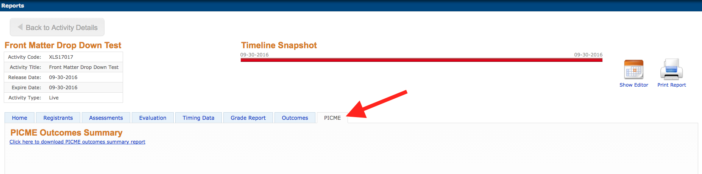
>This *optional* system generated content, requires **Activity Type** 
>[*[Live] Perform. Improvement*](/details) be selected during **Activity Code Setup** and that
>**Designed to Change Performance?** be checked in the **Activity Details Dialog** under
>subheading [**Accreditation**](/accreditation). The **PICME** tab will appear in the **View Reports
>Dialog** Information pertaining to Project AIM is available in the **PICME**
>reporting tab.  

PI - Project Data Collection

>*See PI - Project AIM above*  
>Click on the indicated link to download the report.

PI - Project Data Source
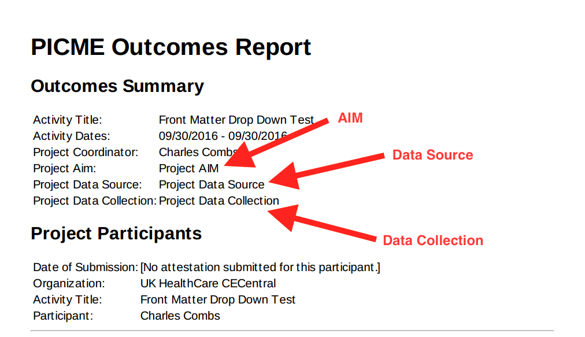
>*See PI - Project AIM and PI - Project Data Collection above*  
>View AIM, Data Collection, Data Sources in the indicated portions of the report.

Refund Policy
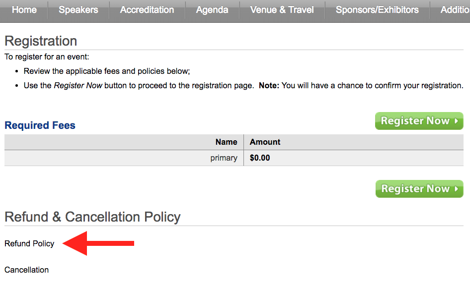
>This *optional* custom content, overriding the system generated content, provides
>a refund policy and instructions in circumstances not covered by the refund
>policy. The cancellation policy appears at the bottom of the **Registration Form**.

Save the Date
>This *optional* custom content, overriding the system generated content,
>appears in the **Venue & Travel** tab of the Live Event page.

Special Services
>This *optional* custom content, overriding the system generated content, provides
>an Special Services message in circumstances not covered by the default
>message. The Special Services message appears underneath the **Register Online**,
>**Download Materials**, and social media buttons, in the right hand sidebar of the
>Live Event page.

Sponsors/Exhibitors
>This *optional* custom content, overriding the system generated content,
>appears in the **Sponsors/Exhibitors** tab of the Live Event page.

---

**Notes**:

---

>All **required** front matter items must be created in order to display a Live
>Event page in a format other than **Save the Date**.

