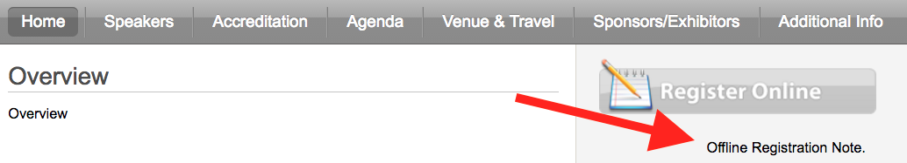
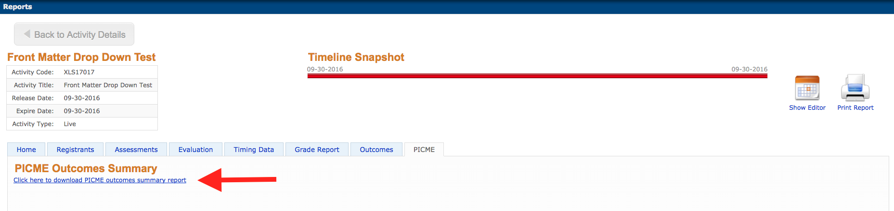

#Activities: Front Matter

---

##Manage Content

---

>Explanation

---

###Add Content

---

>Explanation

---

###Enduring Activity

---

>Explanation

---

###Content Type\* - `Explanation`

---

_Select One_

`Required`

Faculty Disclosure
>This *required* custom content, generated by the Coordinator, appears in the
>**Activity Home** tab of the Enduring Activity page.

Needs Statement
>This *required* custom content, generated by the Coordinator, states the learning
>need for the activity, and appears in the **Activity Home** tab of the Enduring
>Activity page.

Objectives
>This *required* custom content, generated by the Coordinator, states the learning
>objectives for the activity, and appears in the **Activity Home** tab of the
>Enduring Activity page.

Target Audience
>This *required* custom content, generated by the Coordinator, lists the
>profession(s) and specialt_y_(ies) served by the activity, and appears in the
**Activity Home** tab of the Enduring Activity page.

`Optional`

Accreditation Override
>This *optional* custom content, overriding the system generated content, provides
>the required language for accreditation of the activity in circumstances not
>covered by the default language. Accreditation statements appear in the
>**Activity Home** tab of the Enduring Activity page. 
 
Acknowledgment
>This *optional* custom content, overriding the system generated content, provides
>acknowledgement of Sponsors (Clients) for the activity in circumstances not
>covered by the default language.  Acknowledgement statements appear in the
>**Activity Home** tab of the Enduring Activity page. 

CHES Areas of Responsibility
>**Is this optional system generated content?**
>Statements pertaining to the [Seven Areas of Responsibility](http://www.nchec.org/responsibilities-and-competencies) for a Certified Health Education
>Specialist as they relate to the activity. CHES statements appear in the
>**Activity Home** tab of the Enduring Activity page.

Certificate Footer Message

>This *optional* custom content, overriding the system generated content, provides
>custom text for the footer of the certificate.

Custom

>This *optional* custom content, generated by the Coordinator, creates a custom
>section of text underneath a custom heading on the **Activity Home** tab of the
>Live Event page.

Heading

>This *optional* custom content, generated by the Coordinator, ... appears in
>the **Activity Home** tab of the Live Event page.

---

###Live Activity

---

###Content Type\* - `Explanation`

---

_Select One_

`Required` - Explanation

Objectives
>This *required* custom content, generated by the Coordinator, states the learning
>objectives for the activity, and appears in the **Accreditation** tab of the Live
>Event page.

Target Audience
>This *required* custom content, generated by the Coordinator, lists the
>profession(s) and specialt_y_(ies) served by the activity, and appears in the
>**Accreditation** tab of the Live Event page.
    
`Optional` - Explanation

Accommodations
>This *optional* custom content, generated by the Coordinator, ...
>and appears in the **Home** tab of the Live Event page.

Accreditation Override
>This *optional* custom content, overriding the system generated content, provides
>the required language for accreditation of the activity in circumstances not
>covered by the default language. Accreditation statements appear in the **Home** *AND*
>**Accreditation** tabs of the Live Event page. 

Acknowledgment
>This *optional* custom content, overriding the system generated content, provides
>acknowledgement of Sponsors (Clients) for the activity in circumstances not
>covered by the default language.  Acknowledgement statements appear in the
>**Home** and **Accreditation** tabs of the Live Event page. 

Additional Info
>This *optional* custom content, generated by the Coordinator, ...
>and appears in the **Additional Info** tab of the Live Event page.

Agenda

>This *optional* custom content, overriding the system generated content,
>defines the agenda for an activity in circumstances not covered by the default
>agenda and appears in the **Agenda** tab of the Live Event page.

CHES Areas of Responsibility
>**Is this optional system generated content?**
>Statements pertaining to the [Seven Areas of Responsibility](http://www.nchec.org/responsibilities-and-competencies) for a Certified Health Education
>Specialist as they relate to the activity. CHES statements appear in the
>**Accreditation** tab of the Live Event page.

Cancellation*
>This *optional* custom content, overriding the system generated content, provides
>a cancellation policy and instructions in circumstances not covered by the
>default cancellation policy. The cancellation policy appears at the bottom of
>the registration form.

Certificate Footer Message

>This *optional* custom content, overriding the system generated content, provides
>custom text for the footer of the certificate.

Custom
>This *optional* custom content, generated by the Coordinator, creates a custom
>section of text underneath a custom heading on the **Home** tab of the Live Event
>page.

Faculty Disclosure
>This *optional* custom content, generated by the Coordinator, appears in the
>**Speakers** tab of the Live Event page.

Needs Statement
>This *optional* custom content, generated by the Coordinator, states the learning
>need for the activity, and appears in the **Accreditation** tab of the Live Event
>page.

Offline Registration Note

>This *optional* custom content, overriding the system generated content, provides
>an offline registration note in circumstances not covered by the default
>message. The offline registration note appears underneath the Register Online 
>button, in the right hand sidebar of the Live Event page, when the Register
>Online button is clicked.

Overview
>This *optional* custom content, generated by the Coordinator, ...
>and appears in the **Home** tab of the Live Event page.

PI - Project AIM

>View Reports -> PICME Tab
>Requires Activity Type of "Live Performance Improvement", Checkboxes for
>Performance Improvement

PI - Project Data Collection

>Click here to download the report.

PI - Project Data Source

>View AIM, Data Collection, Data Sources here.

Refund Policy
>This *optional* custom content, overriding the system generated content, provides
>a refund policy and instructions in circumstances not covered by the refund
>policy. The cancellation policy appears at the bottom of the registration form.

Save the Date
>This *optional* custom content, overriding the system generated content, ...
>... and appears in the **Venue & Travel** tab of the Live Event page.
    
---

**Notes**:

---

>Notes Notes Notes

