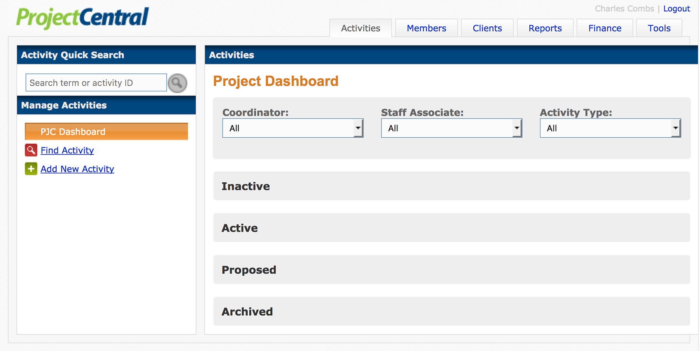
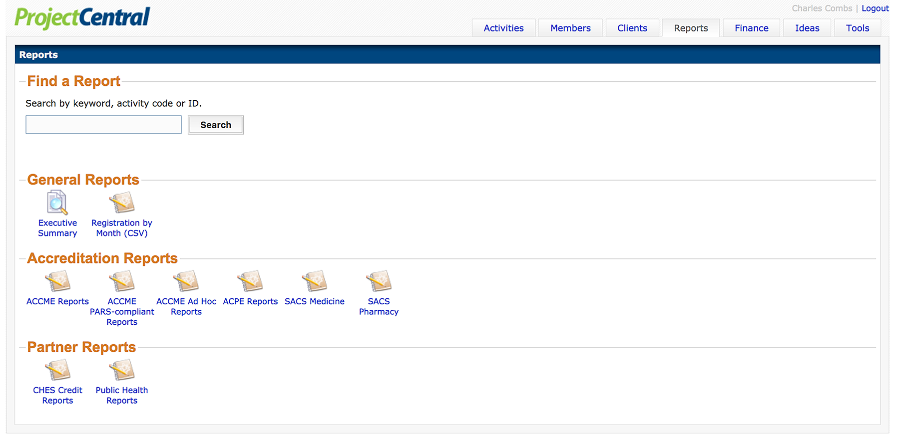

# Project Central User Manual

---

###Version 0.02 _alpha_

>Cecentral.github.io "Guidebook" is moving into its 0.02 alpha release. What does
>this mean for the Guidebook? There is a new, easier to read image format. Many
>new, readable images of menu's and options are on the way, as fast as they can
>be edited. After taking on feedback about the design of 0.01, there is a clearer
>roadmap to a final form for the Guidebook. If you wish to contribute content to
>the Guidebook, there is now a trial process to do that! Contact us and we can
>go over the details.

---

#Summary of Tabs

---

##[Activities](/activities)

---

---

##Members

---

---

##Clients

---

---

##Reports

---

---

##Finance

---

---

##Ideas

---

##Tools

---

---
