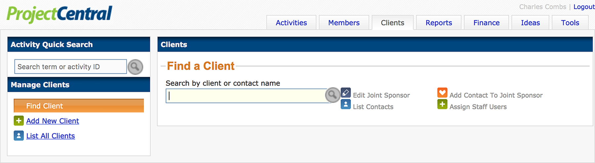
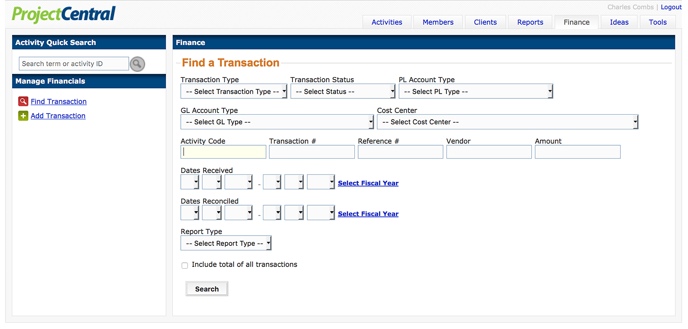

# Project Central User Manual

---

###Version 0.01 _alpha_

>Cecentral.github.io "Guidebook" is in alpha testing. Many features are disabled / under development. Currently included features are not guaranteed to be in the next alpha release. Subheading "Activities" navigates to functional portions of the site, though some items may be stubs. The "Credit Type Requests" button is being tested live. Please contact us by e-mail after filing requests.

---

#Summary of Tabs

---

##[Activities](/activities)

---

---

##Members

---

---

##Clients

---

---

##Reports

---

---

##Finance

---

---

##Ideas

---

##Tools

---

---
