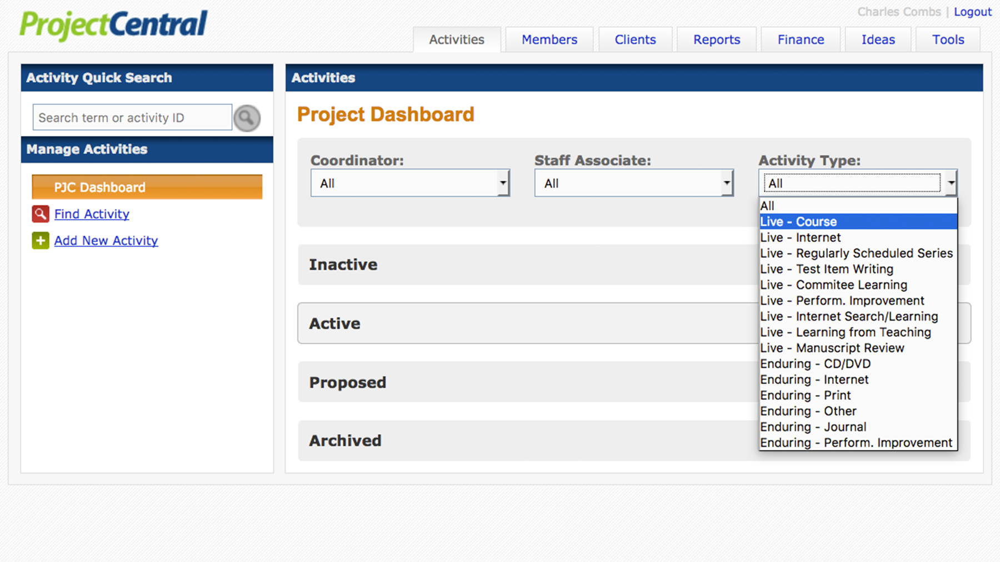
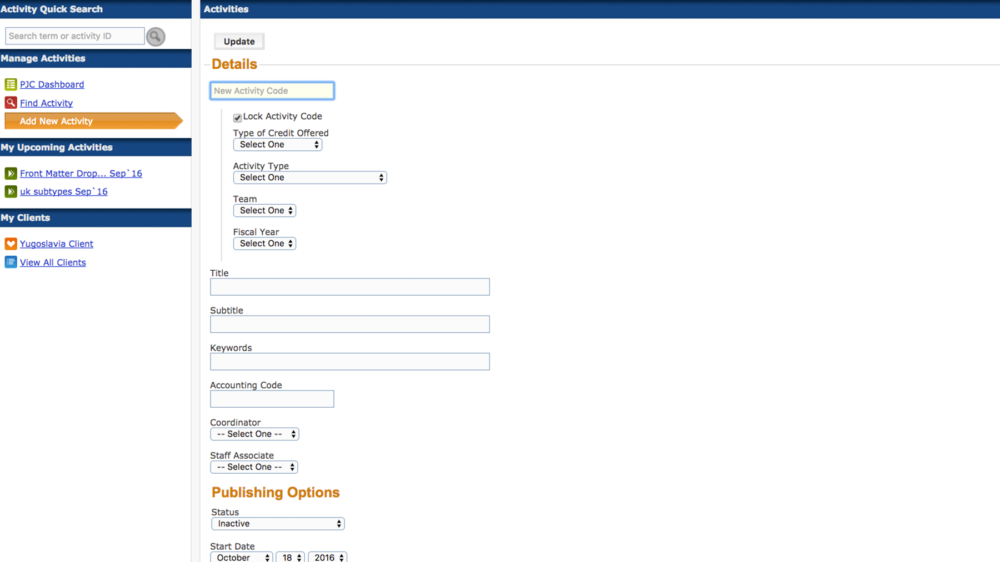

# `Activities`

---

##[Activity Quick Search](/activity-dialog)

---

---
>**_Find an Activity_**: Search here using a Keyword, Activity Code, or Activity ID. 
>Click the checkbox to enable searching by date range.

---

##**Manage Activities**

---

##[PJC Dashboard](/activity-dialog)

---

> Notes
> ...
> ...
> ...

---

##Coordinator

---

---

>Make a selection here to display activities by a specific Coordinator. The
>default selection is *All*.

---

##Staff Associate

---

---

>Make a selection here to display activities by a specific Staff Associate. The
>default selection is *All*.

---

##Activity Type

---

---

>Make a selection here to display activities of a specific type. The
>default selection is *All*.

---

##[Find Activity](/activity-dialog)

---

---

>A short description of Find Activity.

---

##[Add New Activity](/activity-dialog)

---

---

>A short description of Add New Activity.

---

##My Upcoming Activities

---

---

>A short description of My Upcoming Activities.

---

##My Clients

---

---

>A short description of My Clients.

---
