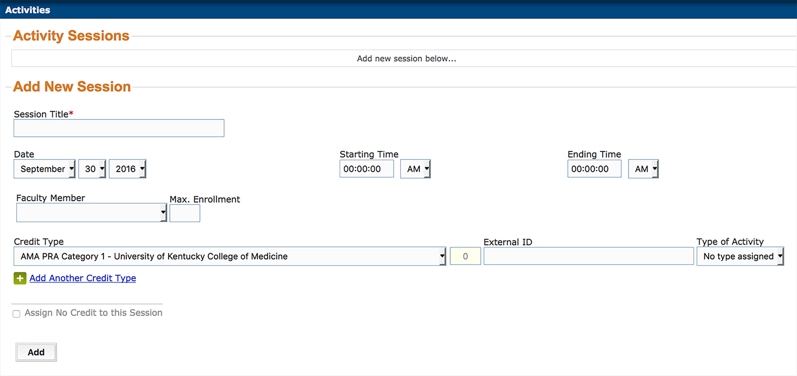
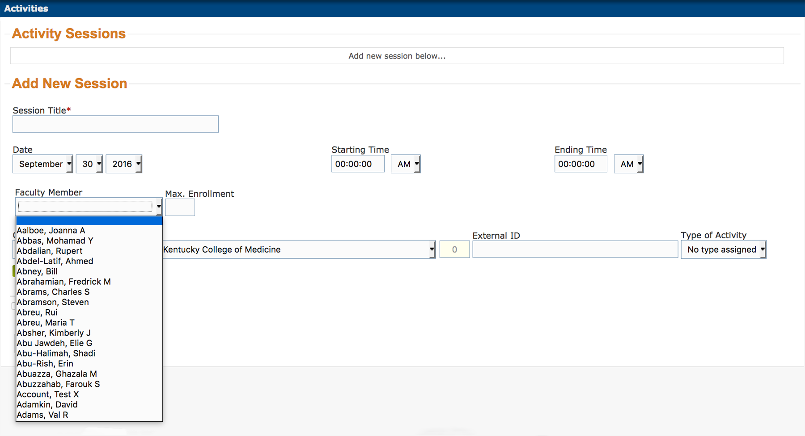
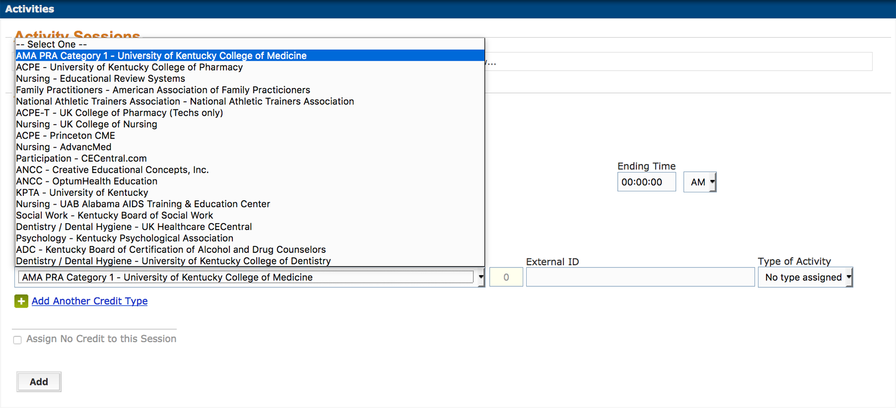
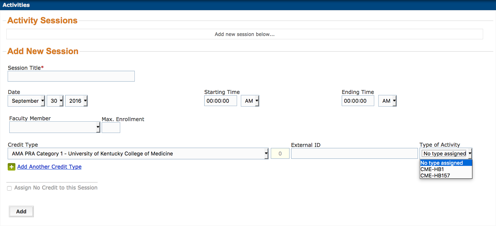

#Activites: `Sessions`

---

---

##Sessions

---

>A table of sessions attached to the activity will appear in the space above the
> Add New Session form.

---

##Add New

---

>Describe the Add New Session Form.

---

##Title

---

##Date

---

##Starting

---

##Ending

---

##Faculty

---

---

##Enrollment

---

>Maximum enrollment is for the session only, and does not interact with other
> limits on registration. It's primary use should be to limit class size.

---

##Credit Type

---

---

##External ID

---

##Type

---

---

##No Credit

---

##Add

---

>The Add button must be clicked to upload information to the site. Navigating
> away from the page without submitting the form will result in lost data.

---